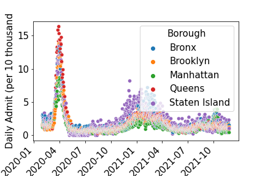

### Covid and Police Activity

&emsp
Covid in New York City has had a great socio-economic impact on our lives. Analysing Covid death, case and hospitalization counts and understanding the movement of Covid throughout the city and each propspective borough can be a powerful tool and informative science to help minimize some of these metrics. One of the areas that I thought would be affect during covid was public saftey and police prescene due to the fact of quarantine. How did Covid affect crime and police activity and is there at all a correlation. Initially, I thought there would be as quarantine slowly was not being followed while governemnt positions were forced to be quarantine could crime sky rocket during the pandemic? Using sklearn, pandas, and visualization tools such as matplotlib, we can begin to see trend.

### Data
# Covid Data
Most of the data gathered by Covid was from NYCOpenSourceData and https://github.com/nychealth/coronavirus-data, which was a github repo containing a vast amount of specific data. It contains death counts, hospitalization rates, probable rates, age divsion for hospital admittions, boroughs, and daily case counts for each borough and age group. 

# New York Data
To calculate a percent infection, pulling borough population data from NYCOpenSource was necessary to compare it with the numbers from the Covid data.

# Police Data
Also, from NYCOpenSource arrest and shooting statistics were used to compare trends between Covid and police activity which included features such as crime description, date and time, race, gender, age etc. 
hr/>
### Visualizing Death Rate, Hospitialization Rate, Contract Rate 

Covid Case Count           |  Covid Death Rate         | Covid Hospitalization Count
:-------------------------:|:-------------------------:|:-------------------
  |   | 

Borough Covid Affect       |  Percent Hospitalization   
:-------------------------:|:-------------------------
  | 

